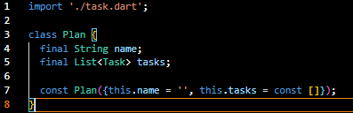
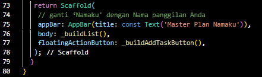
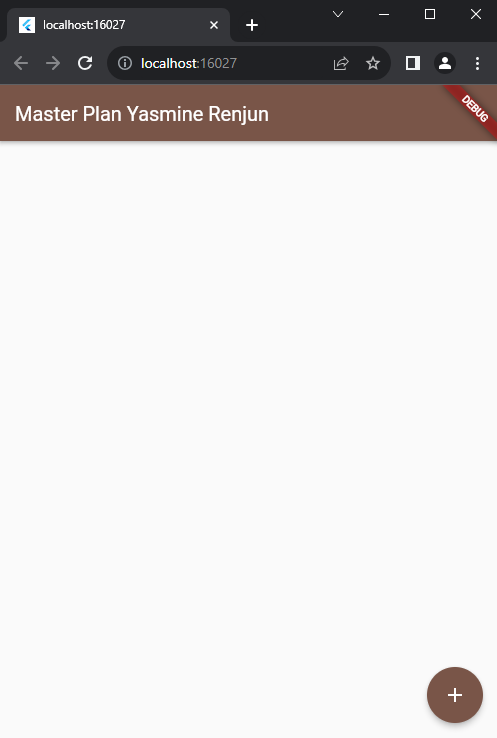
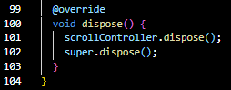
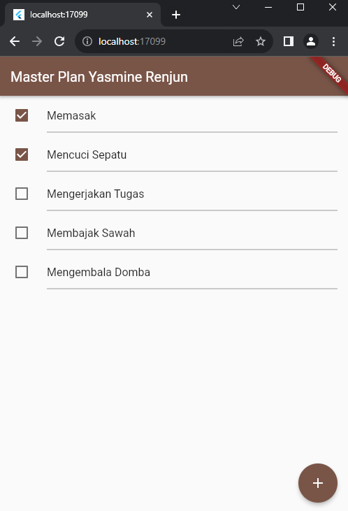

## **(2141720047) Yasmine Navisha Andhani - TI_3G**
Link Github : 

# Jobsheet Pertemuan 11 - Dasar State Manajemen

***
## Praktikum 1: Dasar State dengan Model-View

### Langkah 1: Buat Project Baru
Buatlah sebuah project flutter baru dengan nama master_plan di folder src week-11 repository GitHub Anda. Lalu buatlah susunan folder dalam project seperti gambar berikut ini.

### Langkah 2: Membuat model task.dart
Praktik terbaik untuk memulai adalah pada lapisan data (data layer). Ini akan memberi Anda gambaran yang jelas tentang aplikasi Anda, tanpa masuk ke detail antarmuka pengguna Anda. Di folder model, buat file bernama task.dart dan buat class Task. Class ini memiliki atribut description dengan tipe data String dan complete dengan tipe data Boolean, serta ada konstruktor. Kelas ini akan menyimpan data tugas untuk aplikasi kita. Tambahkan kode berikut:

### Langkah 3: Buat file plan.dart
Kita juga perlu sebuah List untuk menyimpan daftar rencana dalam aplikasi to-do ini. Buat file plan.dart di dalam folder models dan isi kode seperti berikut.

### Langkah 4: Buat file data_layer.dart
Kita dapat membungkus beberapa data layer ke dalam sebuah file yang nanti akan mengekspor kedua model tersebut. Dengan begitu, proses impor akan lebih ringkas seiring berkembangnya aplikasi. Buat file bernama data_layer.dart di folder models. Kodenya hanya berisi export seperti berikut.

### Langkah 5: Pindah ke file main.dart
Ubah isi kode main.dart sebagai berikut.

### Langkah 6: buat plan_screen.dart
Pada folder views, buatlah sebuah file plan_screen.dart dan gunakan templat StatefulWidget untuk membuat class PlanScreen. Isi kodenya adalah sebagai berikut. Gantilah teks ‘Namaku' dengan nama panggilan Anda pada title AppBar.

### Langkah 7: buat method _buildAddTaskButton()
Anda akan melihat beberapa error di langkah 6, karena method yang belum dibuat. Ayo kita buat mulai dari yang paling mudah yaitu tombol Tambah Rencana. Tambah kode berikut di bawah method build di dalam class _PlanScreenState.

### Langkah 8: buat widget _buildList()
Kita akan buat widget berupa List yang dapat dilakukan scroll, yaitu ListView.builder. Buat widget ListView seperti kode berikut ini.

### Langkah 9: buat widget _buildTaskTile
Dari langkah 8, kita butuh ListTile untuk menampilkan setiap nilai dari plan.tasks. Kita buat dinamis untuk setiap index data, sehingga membuat view menjadi lebih mudah. Tambahkan kode berikut ini.

Run atau tekan F5 untuk melihat hasil aplikasi yang Anda telah buat. Capture hasilnya untuk soal praktikum nomor 4.

### Langkah 10: Tambah Scroll Controller
Anda dapat menambah tugas sebanyak-banyaknya, menandainya jika sudah beres, dan melakukan scroll jika sudah semakin banyak isinya. Namun, ada salah satu fitur tertentu di iOS perlu kita tambahkan. Ketika keyboard tampil, Anda akan kesulitan untuk mengisi yang paling bawah. Untuk mengatasi itu, Anda dapat menggunakan ScrollController untuk menghapus focus dari semua TextField selama event scroll dilakukan. Pada file plan_screen.dart, tambahkan variabel scroll controller di class State tepat setelah variabel plan.

### Langkah 11: Tambah Scroll Listener
Tambahkan method initState() setelah deklarasi variabel scrollController seperti kode berikut.

### Langkah 12: Tambah controller dan keyboard behavior
Tambahkan controller dan keyboard behavior pada ListView di method _buildList seperti kode berikut ini.

### Langkah 13: Terakhir, tambah method dispose()
Terakhir, tambahkan method dispose() berguna ketika widget sudah tidak digunakan lagi.

### Langkah 14: Hasil
Lakukan Hot restart (bukan hot reload) pada aplikasi Flutter Anda. Anda akan melihat tampilan akhir seperti gambar berikut. Jika masih terdapat error, silakan diperbaiki hingga bisa running.

## Tugas Praktikum 1
1. Selesaikan langkah-langkah praktikum tersebut, lalu dokumentasikan berupa GIF hasil akhir praktikum beserta penjelasannya di file README.md! Jika Anda menemukan ada yang error atau tidak berjalan dengan baik, silakan diperbaiki.

2. Jelaskan maksud dari langkah 4 pada praktikum tersebut! Mengapa dilakukan demikian?

    Jawab : 

    Penambahan data_layer.dart yang dilakukan pada langkah 4 bertujuan untuk membuat class yang berisi data/model yang akan digunakan pada program. Hal tersebut sangat bermanfaat dalam menulis kode yang efisien dan efektif, karena jika terdapat banyak data/model yang perlu untuk diimpor pada suatu file, hal ini dapat disingkat dengan hanya melakukan import pada data_layer.dart. Dapat dibayangkan jika terdapat 10 data class dan ingin melakukan import 10 data class tersebut pada beberapa file, maka hal tersebut tentu akan tidak efektif dan ribet. Maka dari itu diperlukanlah data_layer.dart ini.

3. Mengapa perlu variabel plan di langkah 6 pada praktikum tersebut? Mengapa dibuat konstanta ?

    Jawab :

    Hal ini dikarenakan isi atau beberapa widget dari file plan_screen.dart memerlukan model data dari Plan itu sendiri, sehingga perlu untuk dibuat variabel objek dari class Plan. Variabel ini dibuat konstanta karena dapat membuat performa aplikasi lebih baik

4. Lakukan capture hasil dari Langkah 9 berupa GIF, kemudian jelaskan apa yang telah Anda buat!

    Jawab :

    Aplikasi yang dibuat merupakan aplikasi untuk menyimpan Plan dengan fitur penambahan plan dan ceklis yang dibuat dengan menggunakan struktur model-view.

5. Apa kegunaan method pada Langkah 11 dan 13 dalam lifecyle state ?

    Jawab :

    * initState: method initState pada lifecycle state berguna untuk melakukan inisialisasi data yang dibutuhkan oleh widget. Method ini akan dipanggil ketika widget pertama kali dibuat. Pada program ini, method ini digunakan untuk menginisialisasi scrollController yang akan menghapus focus pada masing-masing text field ketika melakukan scroll.

    * dispose: methode dispose pada lifecycle state berguna untuk melakukan pembersihan data yang tidak diperlukan lagi. Method ini akan dipanggil ketika widget dihapus dari tree. Pada program ini, method ini digunakan untuk membersihkan data yang tidak diperlukan lagi pada listview yang berisi plan yang telah dibuat.

6. Kumpulkan laporan praktikum Anda berupa link commit atau repository GitHub ke spreadsheet yang telah disediakan!

## Praktikum 2: Mengelola Data Layer dengan InheritedWidget dan InheritedNotifier

### Langkah 1: Buat file plan_provider.dart
Buat folder baru provider di dalam folder lib, lalu buat file baru dengan nama plan_provider.dart berisi kode seperti berikut.

### Langkah 2: Edit main.dart
Gantilah pada bagian atribut home dengan PlanProvider seperti berikut. Jangan lupa sesuaikan bagian impor jika dibutuhkan.

### Langkah 3: Tambah method pada model plan.dart
Tambahkan dua method di dalam model class Plan seperti kode berikut.

### Langkah 4: Pindah ke PlanScreen
Edit PlanScreen agar menggunakan data dari PlanProvider. Hapus deklarasi variabel plan (ini akan membuat error). Kita akan perbaiki pada langkah 5 berikut ini.

### Langkah 5: Edit method _buildAddTaskButton
Tambahkan BuildContext sebagai parameter dan gunakan PlanProvider sebagai sumber datanya. Edit bagian kode seperti berikut.

### angkah 6: Edit method _buildTaskTile
Tambahkan parameter BuildContext, gunakan PlanProvider sebagai sumber data. Ganti TextField menjadi TextFormField untuk membuat inisial data provider menjadi lebih mudah.

### Langkah 7: Edit _buildList
Sesuaikan parameter pada bagian _buildTaskTile seperti kode berikut.

### Langkah 8: Tetap di class PlanScreen
Edit method build sehingga bisa tampil progress pada bagian bawah (footer). Caranya, bungkus (wrap) _buildList dengan widget Expanded dan masukkan ke dalam widget Column seperti kode pada Langkah 9.

### Langkah 9: Tambah widget SafeArea
Terakhir, tambahkan widget SafeArea dengan berisi completenessMessage pada akhir widget Column. Perhatikan kode berikut ini.

Akhirnya, run atau tekan F5 jika aplikasi belum running. Tidak akan terlihat perubahan pada UI, namun dengan melakukan langkah-langkah di atas, Anda telah menerapkan cara memisahkan dengan baik antara view dan model. Ini merupakan hal terpenting dalam mengelola state di aplikasi Anda.

## Tugas Praktikum 2
1. Selesaikan langkah-langkah praktikum tersebut, lalu dokumentasikan berupa GIF hasil akhir praktikum beserta penjelasannya di file README.md! Jika Anda menemukan ada yang error atau tidak berjalan dengan baik, silakan diperbaiki sesuai dengan tujuan aplikasi tersebut dibuat.

2. Jelaskan mana yang dimaksud InheritedWidget pada langkah 1 tersebut! Mengapa yang digunakan InheritedNotifier?

    Jawab : 

    InheritedWidget digunakan dalam file plan_provider.dart, seperti yang telah ditunjukkan pada point sebelumnya. Hanya saja InheritedWIdget tidak memiliki fungsi yang dapat melakukan notify widget dibawahnya secara built-in sehingga diperlukan juga InheritedNotifier untuk melakukan hal tersebut.

3. Jelaskan maksud dari method di langkah 3 pada praktikum tersebut! Mengapa dilakukan demikian?

    Jawab :

    Method-method yang digunakan pada langkah 3 berfungsi untuk menghitung jumlah task yang selesai dan return hasilnya. Kemudian completenessMessage berfungsi untuk menunjukkan pesan mengenai jumlah task yang telah selesai.

4. Lakukan capture hasil dari Langkah 9 berupa GIF, kemudian jelaskan apa yang telah Anda buat!

    Jawab :

    Pada praktikum 2 ini menambahkan sebuah text dibawah yang menunjukkan jumlah task yang telah diselesaikan atau diceklis dari aplikasi Praktikum 1. Kemudian terdapat tambahan pada kode program untuk menerapkan state management yang baik dengan menggunakan InheritedWidget dan InheritedNotifier.

5. Kumpulkan laporan praktikum Anda berupa link commit atau repository GitHub ke spreadsheet yang telah disediakan!

## Praktikum 3: Membuat State di Multiple Screens

### Langkah 1: Edit PlanProvider
Perhatikan kode berikut, edit class PlanProvider sehingga dapat menangani List Plan.

### Langkah 2: Edit main.dart
Langkah sebelumnya dapat menyebabkan error pada main.dart dan plan_screen.dart. Pada method build, gantilah menjadi kode seperti ini.

### Langkah 3: Edit plan_screen.dart
Tambahkan variabel plan dan atribut pada constructor-nya seperti berikut.

### Langkah 4: Error
Itu akan terjadi error setiap kali memanggil PlanProvider.of(context). Itu terjadi karena screen saat ini hanya menerima tugas-tugas untuk satu kelompok Plan, tapi sekarang PlanProvider menjadi list dari objek plan tersebut.

### Langkah 5: Tambah getter Plan
Tambahkan getter pada _PlanScreenState seperti kode berikut.

### Langkah 6: Method initState()
Pada bagian ini kode tetap seperti berikut.

### Langkah 7: Widget build
Pastikan Anda telah merubah ke List dan mengubah nilai pada currentPlan seperti kode berikut ini.

### Langkah 8: Edit _buildTaskTile
Pastikan ubah ke List dan variabel planNotifier seperti kode berikut ini.

### Langkah 9: Buat screen baru
Pada folder view, buatlah file baru dengan nama plan_creator_screen.dart dan deklarasikan dengan StatefulWidget bernama PlanCreatorScreen. Gantilah di main.dart pada atribut home menjadi seperti berikut.

### Langkah 10: Pindah ke class _PlanCreatorScreenState
Kita perlu tambahkan variabel TextEditingController sehingga bisa membuat TextField sederhana untuk menambah Plan baru. Jangan lupa tambahkan dispose ketika widget unmounted seperti kode berikut.

### Langkah 11: Pindah ke method build
Letakkan method Widget build berikut di atas void dispose. Gantilah ‘Namaku' dengan nama panggilan Anda.

### Langkah 12: Buat widget _buildListCreator
Buatlah widget berikut setelah widget build.

### Langkah 13: Buat void addPlan()
Tambahkan method berikut untuk menerima inputan dari user berupa text plan.

### Langkah 14: Buat widget _buildMasterPlans()
Tambahkan widget seperti kode berikut.

Terakhir, run atau tekan F5 untuk melihat hasilnya jika memang belum running. Bisa juga lakukan hot restart jika aplikasi sudah running. Maka hasilnya akan seperti gambar berikut ini.

## Tugas Praktikum 2
1. Selesaikan langkah-langkah praktikum tersebut, lalu dokumentasikan berupa GIF hasil akhir praktikum beserta penjelasannya di file README.md! Jika Anda menemukan ada yang error atau tidak berjalan dengan baik, silakan diperbaiki sesuai dengan tujuan aplikasi tersebut dibuat.

2. Berdasarkan Praktikum 3 yang telah Anda lakukan, jelaskan maksud dari gambar diagram berikut ini!

    

    Jawab : 

    Diagram sebelah kiri adalah tahap pembuatan rencana baru dalam aplikasi, di mana pengguna berinteraksi dengan PlanCreatorScreen. Data rencana dan daftar rencana dikelola oleh PlanProvider di bawah MaterialApp, dengan layout menggunakan Column dan Expanded.

    Sedangkan di sebelah kanan, tampilan PlanScreen menampilkan daftar rencana yang ada setelah navigasi. Data juga diatur oleh PlanProvider, dan layoutnya menggunakan Column, Expanded, dan SafeArea. Terdapat ListView untuk menampilkan daftar rencana dan elemen Text di bawah SafeArea untuk pesan tentang kelengkapan rencana.

    Transisi antara keduanya terjadi saat pengguna beralih antara pembuatan rencana (PlanCreatorScreen) dan melihat rencana yang sudah ada (PlanScreen).
    
3. Lakukan capture hasil dari Langkah 14 berupa GIF, kemudian jelaskan apa yang telah Anda buat!

    
    
    
    

    Jawab :

    Implementasi ini memungkinkan pengguna untuk mengelola dan melihat daftar rencana dengan lebih dinamis, dan aplikasi dapat menyesuaikan tampilan sesuai dengan perubahan pada data yang dikelola.

4. Kumpulkan laporan praktikum Anda berupa link commit atau repository GitHub ke spreadsheet yang telah disediakan!
